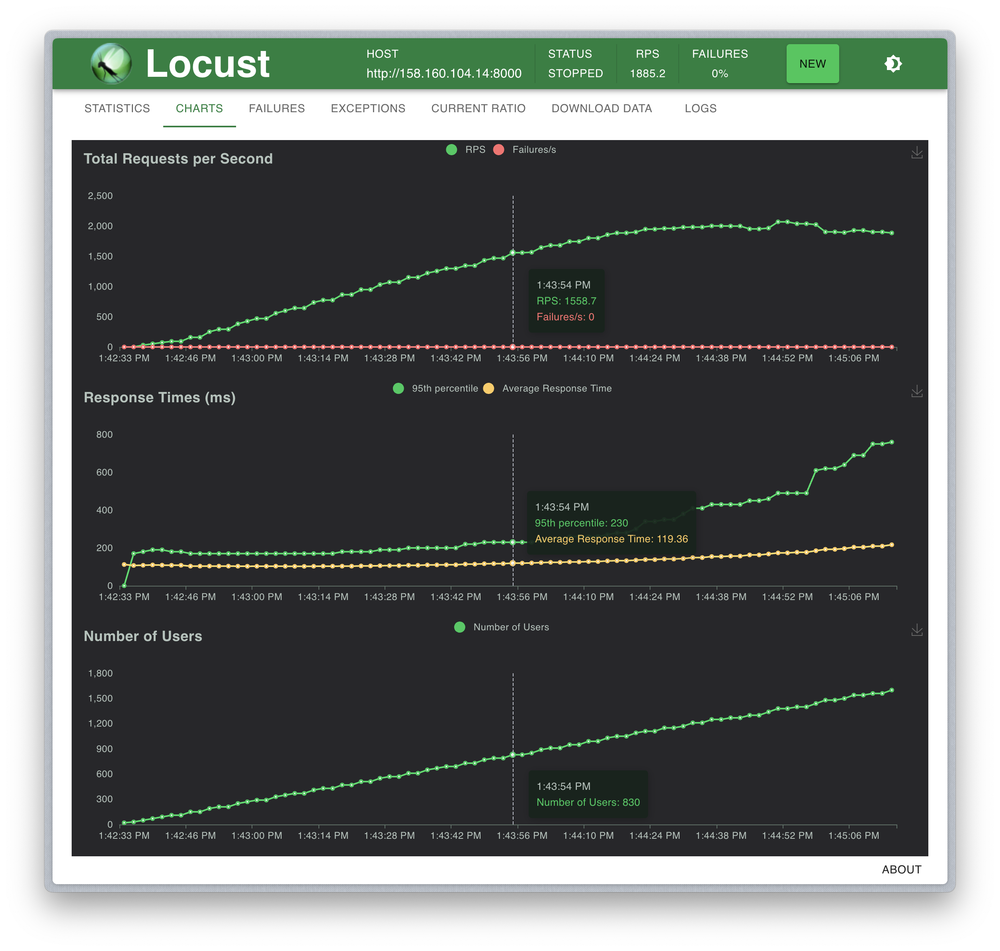
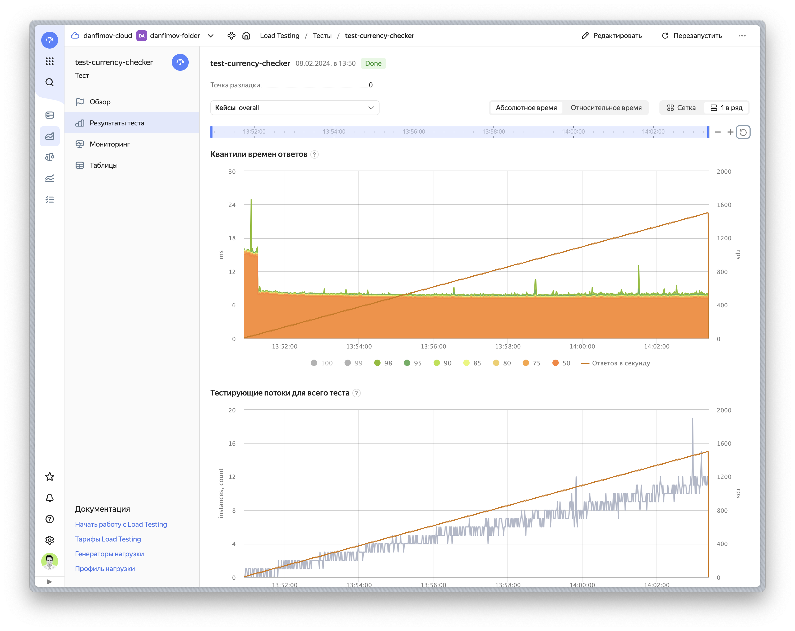

# Currency checker

> [!NOTE]
> This repo contains solution to a test task when applying for a job. I did it for one evening, so it's not production ready, actively maintained etc. Please use code from here with caution.

Project have two parts:

- API for getting cryptocurrency rate in RUB and USD 
- Async worker for getting info about cryptocurrency rates from various platform APIs.

## Tech details and problems

### Currency rates on different platforms

I don’t know the cryptocurrency domain very well, so I didn’t fully understand what USDTTRC and USDTERC are.
A quick search on the Internet told me that this is Tether (USDT), which is processed by various Ethereum (USDTERC) and Tron (USDTTRC) infrastructures.

The Coingeko API and Binance API don't seem to have the option to show a different rate for them.
Therefore, I used regular USDT as USDTERC, and regular TRX instead of USDTTRC (to preserve the number of possible options).

Plus, the Binance API cannot display information on the USDT-USD exchange rate. Since this cryptocurrency pegged to the USD, I hardcoded the currency rate as 1.

### Coingeko free account

Coingeko have RPS limit for free accounts: 10_000 requests/month and 10-30 requests/minute. 
Because of that we need plenty of accounts for minimize time for updating exchange rates. 

Safe path for testing - use one account with env variable `COINGEKO_SCHEDULER__INTERVAL=60` for example.
On production this interval should be less of course.

## Before run

1. Copy `conf/.env.example` to `conf/.env` (example variables optimized for running app in docker containers):
    ```bash
    cp conf/.env.example conf/.env
    ```

2. Run migrations
    ```bash
    make migrate
    ```

    Alternatively you can set `RUN_MIGRATIONS_ON_STARTUP=1` and run application.

3. Add token from alive Coingeko accounts to `accounts` table, for example:
   ```sql
   INSERT INTO public.accounts (token, source, active) VALUES ('CG-JRbBUYiLpTvoSrwgiMWL397S', 'coingeko', 'true');
   ```

## Run on docker

```bash
docker compose up -d --remove-orphans --force-recreate --build
```

## Local run

Scheduler:
```bash
poetry run python3 -m currency_checker.scheduler
```

Broker with workers:
```bash
poetry run python3 -m currency_checker.scheduler.broker
```

API:
```yaml
poetry run python3 -m currency_checker.api
```

## Load testing

### Local run

First, I run locust load test on containers with application and databases. 
For better API performance instead of running container with one uvicorn process, I used `gunicorn` with more workers:
```bash
poetry run gunicorn currency_checker.api.__main__:app --workers 8 --worker-class uvicorn.workers.UvicornWorker --bind [::]:8000"
```

I believe that this API can be used with other services. For simulating users (other services) behaviour I added three tasks:

- request for currency rates from binance 
- request for currency rates from coingeko
- "ping" request for checking that service is alive (this request frequency is 100x lower than normal one)

You can see results and graph below:

```
Type     Name                                                                          # reqs      # fails |    Avg     Min     Max    Med |   req/s  failures/s
--------|----------------------------------------------------------------------------|-------|-------------|-------|-------|-------|-------|--------|-----------
GET      /ping                                                                           1738     0(0.00%) |      3       0      51      2 |   14.53        0.00
GET      /v1/courses/?exchanger=binance                                                 86428     0(0.00%) |      5       1     201      4 |  722.50        0.00
GET      /v1/courses/?exchanger=coingeko                                                85777     0(0.00%) |      5       1     169      4 |  717.06        0.00
--------|----------------------------------------------------------------------------|-------|-------------|-------|-------|-------|-------|--------|-----------
         Aggregated                                                                    173943     0(0.00%) |      5       0     201      4 | 1454.09        0.00

Response time percentiles (approximated)
Type     Name                                                                                  50%    66%    75%    80%    90%    95%    98%    99%  99.9% 99.99%   100% # reqs
--------|--------------------------------------------------------------------------------|--------|------|------|------|------|------|------|------|------|------|------|------
GET      /ping                                                                                   2      3      4      5      8     12     21     31     50     52     52   1738
GET      /v1/courses/?exchanger=binance                                                          4      5      6      6     10     17     27     37     88    160    200  86428
GET      /v1/courses/?exchanger=coingeko                                                         4      5      6      6     10     17     27     38     88    150    170  85777
--------|--------------------------------------------------------------------------------|--------|------|------|------|------|------|------|------|------|------|------|------
         Aggregated                                                                              4      5      6      6     10     17     27     38     88    160    200 173943
```


As you can see 95 percentile during load testing with 1500 RPS was somewhere below 20ms.

### Run with application deployed in cloud

I also run same test with API that deployed on 8 virtual machines behind load balancer (with one uvicorn process on every machine).
Also I have one virtual machine with scheduler and one with workers. As storages, I used Postgres cluster with minimal capacity (for accounts) and Redis cluster (for currency rates).

Results have a same pattern of work except addition network lag that adds 200ms to every request from locust that runs on local machine:

```
Type     Name                                                                          # reqs      # fails |    Avg     Min     Max    Med |   req/s  failures/s
--------|----------------------------------------------------------------------------|-------|-------------|-------|-------|-------|-------|--------|-----------
GET      /ping                                                                           2181     0(0.00%) |    155      70     766    130 |   13.54        0.00
GET      /v1/courses/?exchanger=binance                                                110134     0(0.00%) |    218      70    1090    170 |  683.90        0.00
GET      /v1/courses/?exchanger=coingeko                                               111022     0(0.00%) |    218      70    1095    170 |  689.42        0.00
--------|----------------------------------------------------------------------------|-------|-------------|-------|-------|-------|-------|--------|-----------
         Aggregated                                                                    223337     0(0.00%) |    217      70    1095    170 | 1386.86        0.00

Response time percentiles (approximated)
Type     Name                                                                                  50%    66%    75%    80%    90%    95%    98%    99%  99.9% 99.99%   100% # reqs
--------|--------------------------------------------------------------------------------|--------|------|------|------|------|------|------|------|------|------|------|------
GET      /ping                                                                                 130    170    200    220    280    330    420    460    550    770    770   2181
GET      /v1/courses/?exchanger=binance                                                        170    240    290    320    420    500    630    730    860   1100   1100 110134
GET      /v1/courses/?exchanger=coingeko                                                       170    240    290    320    420    500    630    720    860   1100   1100 111022
--------|--------------------------------------------------------------------------------|--------|------|------|------|------|------|------|------|------|------|------|------
         Aggregated                                                                            170    240    290    320    420    500    630    720    860   1100   1100 223337
```



Because of this lag load test is not representative. So I decided to use proper load test instrument for application that runs in Yandex Cloud - [Load Testing at Yandex Cloud](https://cloud.yandex.ru/ru/docs/load-testing/).

I tested application with this test configuration:
```yaml
uploader:
  enabled: true
  package: yandextank.plugins.DataUploader
  job_name: test-currency-checker
  job_dsc: ''
  ver: ''
  api_address: loadtesting.api.cloud.yandex.net:443
pandora:
  enabled: true
  package: yandextank.plugins.Pandora
  config_content:
    pools:
      - id: HTTP
        gun:
          type: http
          target: 158.160.104.146:8000   # load balancer address
          ssl: false
        ammo:
          type: uri
          uris:
            # it means that 50% of requests will be sent to get currency rates from binance and 50% - from coingeko
            - /v1/courses/?exchanger=binance&directions=BTC-RUB
            - /v1/courses/?exchanger=coingeko&directions=BTC-RUB
          headers:
            - '[Host: 158.160.104.146]'   # load balancer address
            - '[Connection: Keep-Alive]'
        result:
          type: phout
          destination: ./phout.log
        startup:
          type: once
          times: 100
        rps:
          - type: step
            from: 0
            to: 1500
            duration: 5s
            step: 10
        discard_overflow: false
    log:
      level: error
    monitoring:
      expvar:
        enabled: true
        port: 1234
core: {}
```

The results are similar to the first run of tests locally:




## Metrics

Service can provide metrics about:
- API usage;
- Requests from workers to cryptocurrency platform APIs;
- Dramatiq queues;

If you need them, you can run metrics servers by passing env vars to containers:
```dotenv
# Example
API_METRICS_PORT=8001
SCHEDULER_METRICS_PORT=8002
BROKER_METRICS_PORT=8003
```
It will enable metrics servers on this ports and you can collect it with any tool and create dashboards in Grafana.
